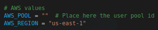
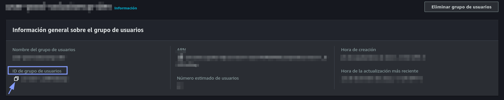
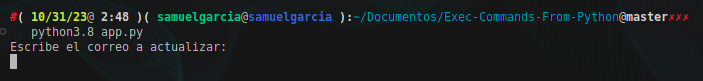
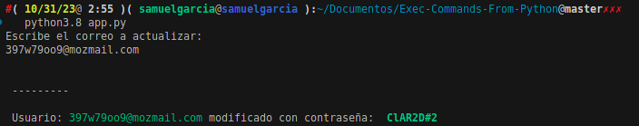
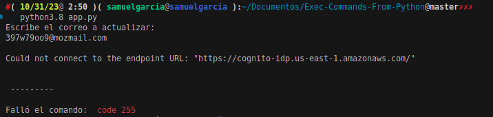

Esta app es para actualizar la contraseña de un usuario en **AWS cognito**.

Uso:

Para utilizar el proyecto es necesario

- Tener instalado Python
- Tener instalado [AWSCLI](https://docs.aws.amazon.com/es_es/cli/latest/userguide/getting-started-install.html)
- Configurar AWSCLI con el comando `aws configure`
- Es importante antes de iniciar el proyecto asignar a la variable `AWS_POOL` (ID del grupo de usuarios a utilizar)
  
  > El valor se puede conseguir en AWS Cognito copiando el ID del grupo de usuarios a utilizar 
- Ejecutar el el archivo app.py con python [Ejemplo: `python3.8 app.py`]

Es necesario insertar el correo cuando la aplicación lo pida

En el caso que el comando sea ejecutado correctamente se mostrará como respuesta el correo y la contraseña que se asignó al usuario.

En el caso que el comando falle se mostrará un mensaje con el codigo recibido.

